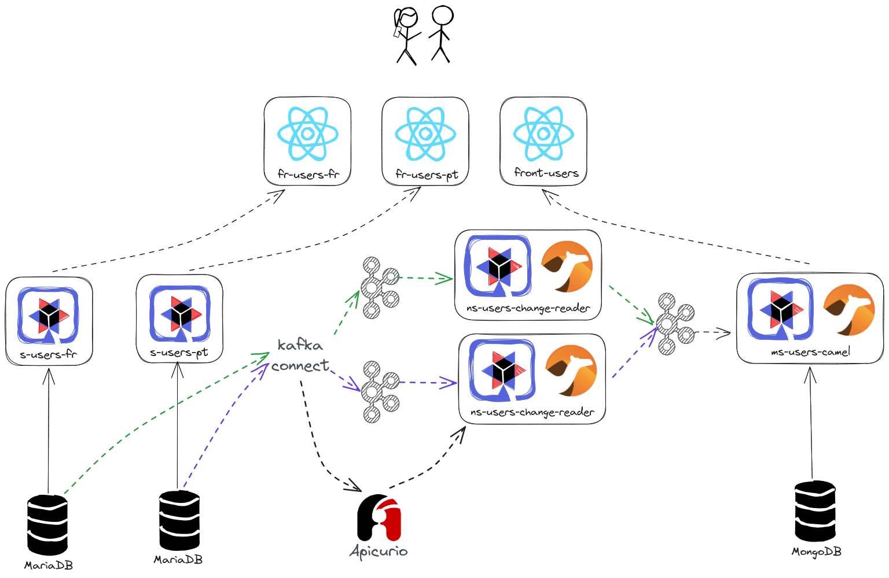

Change Data Capture (CDC) is a design pattern that captures changes made at a source and replicates them to a destination.

In this example, we'll move data from some databases to a Kafka topic, the data will be transformed and saved into another destination database.



# Components

We will use a lot of components and tools to conduct this workshop. The main components are:
* **Kafka:** A distributed streaming platform used to build real-time data pipelines and streaming apps.
* **Kafka Connect:** An integration framework for connecting Kafka with external systems such as databases, key-value stores, and search indexes.
* **Camel:** An open-source integration framework that provides a standardized way to connect to different protocols and technologies.
* **Quarkus:** A Kubernetes-native Java framework tailored for GraalVM and HotSpot, offering fast boot times and low memory usage.
* **ReactJS:** A JavaScript library for building user interfaces, particularly known for its efficient rendering and the concept of component-based architecture."

# Start up

Operator installation:

```bash
oc apply -f cdc-camel-kafka-demo/bootstrap/openshift-gitops.yaml
```

Retrieve ArgoCD route: 

```bash
oc get route -A | grep openshift-gitops-server | awk '{print $3}'
```

Get the ArgoCD admin password: 

```bash
oc -n openshift-gitops get secret openshift-gitops-cluster -o json | jq -r '.data["admin.password"]' | base64 -d
```

ArgoCD needs some privileges to create specific resources. In this demo, we'll apply cluster-role to ArgoCD to avoid the fine-grain RBAC.

```bash
oc apply -f cdc-camel-kafka-demo/bootstrap/cluster-role.yaml
```

Now, we apply the bootstrap application:

```bash
oc apply -f cdc-camel-kafka-demo/bootstrap/bootstrap.yaml
```